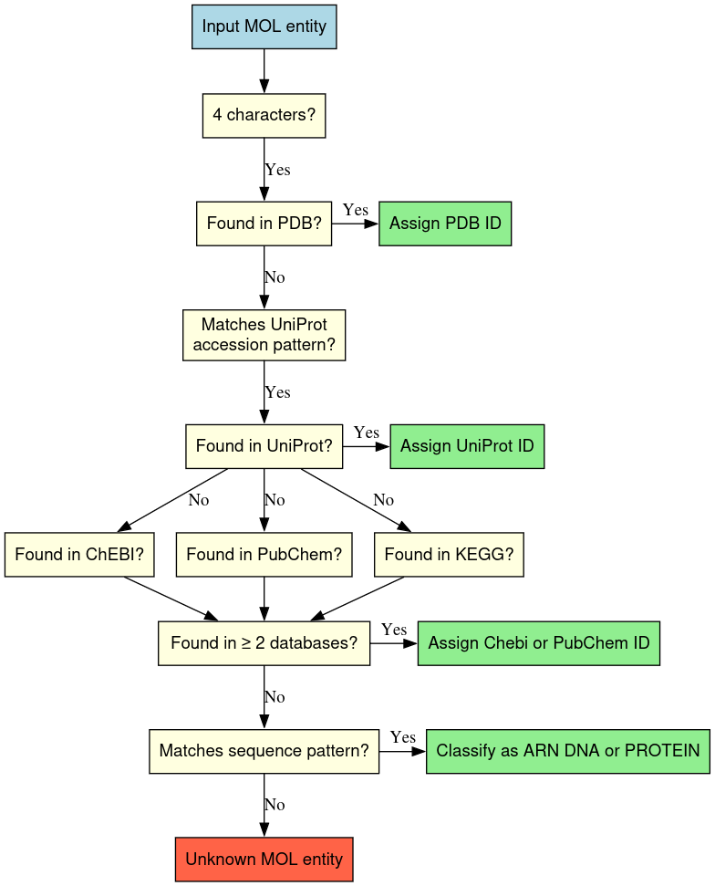

# mdverse_entity_norm

This project implements the normalization pipeline for molecular dynamics (MD) simulation metadata entities. Normalization standardizes entity mentions by mapping them to controlled vocabularies or reference databases (e.g., [ChEBI](https://www.ebi.ac.uk/chebi/), [PubChem](https://pubchem.ncbi.nlm.nih.gov/), [KEGG](https://www.genome.jp/kegg/)), ensuring consistency and interoperability across datasets.
Normalisation is currently supported for four entity types: molecule names (MOL),simulation times (STIME) and temperatures (STEMP), software names (SOFTNAME) and force fields and models (FFM).

## Setup environment

We use [uv](https://docs.astral.sh/uv/getting-started/installation/) to manage dependencies and the project environment.

Clone the GitHub repository:

```sh
git clone https://github.com/MDverse/mdverse_entity_norm.git
cd mdverse_entity_norm
```

Sync dependencies:

```sh
uv sync
```

## Usage

The following scripts require an `entities.tsv` file as input. The file should contain the columns `entity`, `category`, and `json_file`.

### Simulation temperature (STEMP)

To normalize simulation temperatures, run:

```sh
uv run src/mdverse_entity_norm/scripts/normalize_stemp.py --raw-entities-path data/entities.tsv --normalized-stemp-path results/STEMP/stemp_normalized.tsv
```

This reads temperature entities from `data/entities.tsv` and writes `results/STEMP/stemp_normalized.tsv`, a TSV file with four columns:

| raw_temperature | normalised_temperature | normalised_unit | normalized_result |
| --------------- | ---------------------- | --------------- | ----------------- |
| 315             | 315                    | K               | 315 K             |
| 20°C           | 293,15                 | K               | 293,15 K          |
| 310k            | 310                    | K               | 310 K             |

> Special cases `room temperature` and `human body temperature` are normalised to 293 K and 310 K respectively. All Celsius values are converted to Kelvin.

### Simulation times (STIME)

The normalization of simulation times is a two-step process: first, we benchmark several candidate Large Language Models (LLMs) against a gold standard dataset to select the best performer; second, we deploy the chosen model to normalize the entire dataset.

> 🔑 An `OPEN_ROUTER_KEY` environment variable must be set (e.g., via a .env file) to authenticate and authorise API requests to the external LLM providers hosted on OpenRouter.

#### Model evaluation:

To evaluate candidate LLM models on a labelled gold standard, run:

```sh
uv run src/mdverse_entity_norm/scripts/evaluate_llm_models.py \
  --groundtruth-path data/groundtruth/STIME.json \
  --prompt-path data/llm_prompt.txt \
  --runs 10 \
  --model-evaluation-path results/STIME/model_evaluation.tsv
```

This script benchmarks 9 models accessible via OpenRouter (including `GPT-4o`, `DeepSeek V4 Pro`, and `Claude 4.7 Opus`) against a manually annotated gold standard of 100 simulation time entities. The evaluation is repeated over the specified number of runs to ensure statistical robustness.

The evaluation results across the tested models are detailed below:

| model_name                         | accuracy_percentage (%) | normalisation_times_sec (s) | normalisation_cost (USD/entity) |
| ---------------------------------- | ----------------------: | --------------------------: | ------------------------------: |
| openai/gpt-5.5                     |                      99 |                        1.65 |                          0.0028 |
| qwen/qwen3.6-27b                   |                      99 |                       18.80 |                          0.0012 |
| minimax/minimax-m2.7               |                      99 |                       10.72 |                          0.0096 |
| anthropic/claude-opus-4.7          |                      98 |                        2.85 |                          0.0013 |
| **deepseek/deepseek-v4-pro** |            **97** |              **8.39** |                **0.0022** |
| openai/gpt-4o                      |                      95 |                        1.26 |                          0.0016 |
| mistralai/mistral-large-2512       |                      90 |                        4.19 |                          0.0001 |
| moonshotai/kimi-k2.6               |                      89 |                       28.17 |                          0.0002 |
| google/gemma-4-31b-it              |                      62 |                        2.44 |                          0.0002 |

#### Entity normalization:

Based on these results, **DeepSeek V4 Pro** was selected as the optimal open-weight model, offering the best balance between high accuracy (97%), reasonable latency, and cost efficiency.

To apply this model and normalize the entire dataset, run:

```sh
uv run src/mdverse_entity_norm/scripts/normalize_stime_results.py \
  --entities-file data/entities.tsv \
  --output-file results/norm_simu_times/normalized_stime_results.tsv
```

This processes all raw STIME entities and outputs a three-column TSV with the standardized values and units:

| STIME         | value | unit |
| ------------- | ----: | :--: |
| 1 μs         |   1.0 | μs |
| 1 microsecond |   1.0 | μs |
| 200-300ns     | 200.0 |  ns  |
| 200-300ns     | 300.0 |  ns  |

### Ground molecule names

The grounding logic is illustrated below:



```sh
uv run src/mdverse_entity_norm/scripts/normalize_molecules.py
```

This reads molecular entities from `data/entities.tsv`. Entities are first classified by type (PDB, UniProt, DNA, RNA, protein, or small molecule). PDB and UniProt entries are resolved via their respective APIs and saved to `results/ground_molecule/same_grounding_mol/pdb_uniprot_seq_entities.tsv`. Small molecules are grounded by consensus across ChEBI, PubChem, and KEGG, producing two output files:

**`chebi_comparaison.tsv`** — ChEBI grounding results for all small molecules:

| Column                    | Description                            |
| ------------------------- | -------------------------------------- |
| `Molecule`              | Original molecule name                 |
| `CHEBI_ID`              | ID returned directly by ChEBI          |
| `CHEBI_ID_from_KEGG`    | ChEBI ID resolved via KEGG             |
| `CHEBI_ID_from_PubChem` | ChEBI ID resolved via PubChem synonyms |
| `Match`                 | `True` if at least two sources agree |

**`pubchem_comparaison_no_chebi_match.tsv`** — PubChem fallback for molecules with no ChEBI consensus:

| Column                   | Description                     |
| ------------------------ | ------------------------------- |
| `Molecule`             | Original molecule name          |
| `PubChem_ID`           | ID returned directly by PubChem |
| `PubChem_ID_from_KEGG` | PubChem ID resolved via KEGG    |
| `Match`                | `True` if both sources agree  |
