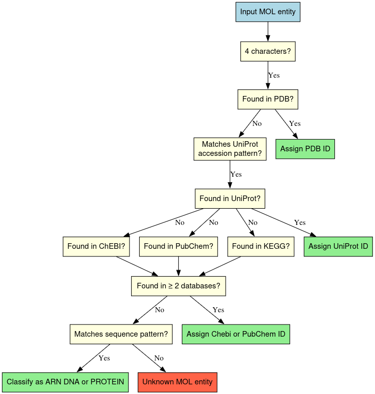

# mdverse_entity_norm

## Setup environment

We use [uv](https://docs.astral.sh/uv/getting-started/installation/)
to manage dependencies and the project environment.

Clone the GitHub repository:

```sh
git clone https://github.com/MDverse/mdverse_entity_norm.git
cd mdverse_entity_norm
```

Sync dependencies:

```sh
uv sync
```

## Usage

This project consists of the normalisation step for mollecular dynamics entities. Currently, we have implemented the normalisation for temperature and the grounding for molecules. The normalisation and grounding processes are performed using the scripts located in the `src/mdverse_entity_norm/scripts` directory. Each script is designed to handle a specific type of entity and can be executed independently. The results of the normalisation and grounding processes are saved in the `results` directory, which is created if it does not already exist. The output files are in TSV format, containing the original entities and their corresponding normalized or grounded values, along with any relevant metadata such as confidence scores or error codes.

### Normalize temperature

To normalize temperature entities, run :

```sh
uv run src/mdverse_entity_norm/scripts/normalize_temperature.py
```
> This command generates a file named `normalized_temperature.tsv` in the `results` directory, containing the normalized temperature entities. The file has two columns: `original_value` and `normalized_value`, where `original_value` is the original temperature entity and `normalized_value` is the normalized temperature entity in Celsius.

### Ground molecules

The logic behind the grounding of molecule entities is described in this image  below   :


To ground molecules entities, run :

```sh
uv run src/mdverse_entity_norm/scripts/ground_molecule.py --mol_filepath data/entities.tsv --grounded_mol_filepath results/grounded_molecules.tsv
```
> This command generates two files in the `results` directory: `grounded_molecules.tsv` and `non_grounded_molecules.tsv`. The `grounded_molecules.tsv` file contains the grounded molecule entities with their corresponding identifiers, while the `non_grounded_molecules.tsv` file contains the molecule entities that could not be grounded.

The `grounded_molecules.tsv` file has six columns :
    `Entity_name` : corresponding to the original molecule name,
    `Database` : corresponding to the database name,
    `ID` : corresponding to the molecule ID,
    `Score` : corresponding to the confidence score,
    `Name` : corresponding to the molecule full name,
    `nb_res` : corresponding to the number of results found.

The`non_grounded_molecules.tsv` file has two columns :
    `Entity_name` : corresponding to the original molecule name that could not be        grounded
    `error` : corresponding to the error code obtained during the grounding process.

### Normalize simulation times
To normalize simulation time entities, run :

```sh
uv run src/mdverse_entity_norm/scripts/normalize_simulation_time.py --ground_truth_file data/STIME_ground_truth.json --runs 10 --model_evaluation_file results/norm_simu_times/model_evaluation.tsv
```
> This command generates a file named `normalized_simulation_time.json` in the `results` directory, containing the normalized simulation time entities. The file is in JSON format, where each key is a simulation time entity and its corresponding value is the normalized simulation time value and time unit in the standard format. If a simulation time entity could not be normalized, its value will be `null`.
